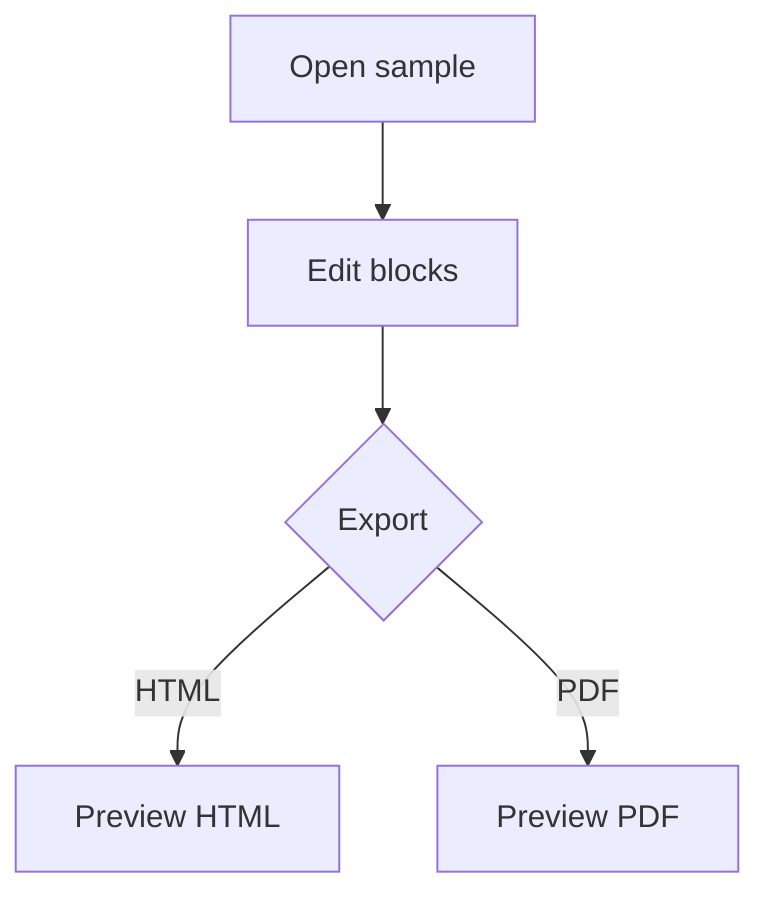

# WNote Editor Regression Sample

Use this document to verify editor rendering, block operations, markdown round trips, assets, and export behavior.

## Inline Formatting

This paragraph includes **bold text**, _italic text_, ~~strikethrough text~~, `inline code`, a [project link](https://example.com), and inline math $E = mc^2$.

> Blockquote content should remain editable and keep inline marks such as **bold**.

---

## Lists

- Unordered item one
- Unordered item two
  - Nested unordered item

1. Ordered item one
2. Ordered item two

- [ ] Unchecked task
- [x] Checked task

## Table

| Feature       | Expected Behavior                   | Status |
| ------------- | ----------------------------------- | ------ |
| Insert row    | Toolbar adds a row near the cursor  | Ready  |
| Delete column | Toolbar removes the selected column | Ready  |
| Header row    | Header toggle preserves cell text   | Ready  |

## Code

```ts
type EditorState = {
  title: string;
  dirty: boolean;
};

export function markSaved(state: EditorState): EditorState {
  return { ...state, dirty: false };
}
```

```unknown-language
This block intentionally uses an unknown language.
It should stay editable with a plain-code fallback.
```

## Math

$$
\int_0^1 x^2 dx = \frac{1}{3}
$$

$$
\invalid{formula
$$

## Mermaid



```mermaid
flowchart TD
  Broken -->
```

## Images

Remote images should render without being treated as local assets:


Missing local images should stay visible as an editable fallback:


## Block Operations

Use the block handle on the following paragraphs:

Move this paragraph up and down.

Duplicate this paragraph.

Insert a new empty paragraph above and below this paragraph.
